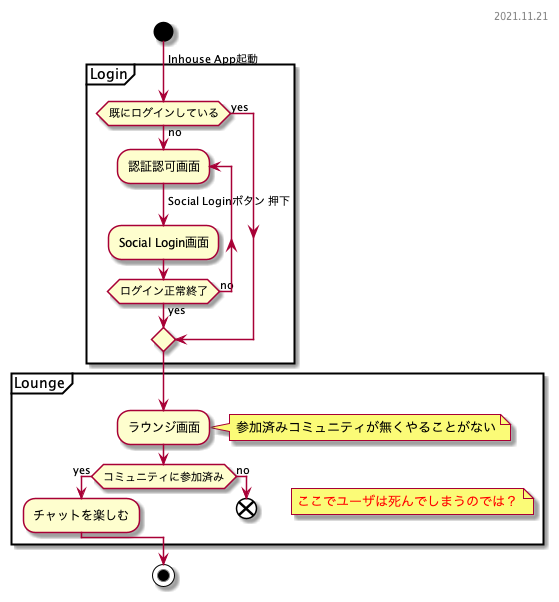

アプリをインストールしたてホヤホヤのユーザが、***ワクワクした状態のまま***メインディッシュを味わって欲しい。味に病み付きになった末に、友人や周囲にオススメしたくなるようなUIを持ってして、多くの人にinhouse Valueが届くと考える。ここでは*人にオススメしたくなるか*という観点は一旦放念し、使用開始直後のユーザがinhouse Valueを味合うまでの道筋を検討するために、この資料を作成した。

アプリ初期起動時はコミュニティに参加していないため、エンドユーザーはinhouse Valueを享受できない。アプリ初期起動から最低1つのコミュニティへの参加が完了するまでのUserActivityフローはユーザ体験の実現において最重要事項と捉え、「ユーザの離脱の阻止」を実現する。

- [1. アプリ初期起動からコミュニティ参加までのアクティビティフロー](#1-アプリ初期起動からコミュニティ参加までのアクティビティフロー)
  - [1.1. 現状](#11-現状)
  - [1.2 案1](#12-案1)

## 1. アプリ初期起動からコミュニティ参加までのアクティビティフロー
### 1.1. 現状
ログイン後の遷移先をラウンジ画面をホームとしているが、コミュニティに参加していないためラウンジ画面ではやることがない。コミュニティ検索へ誘導することは機能的には可能だが、これはユーザアクションを強制するフローであるためUX上あってはならない。決して*大企業の社内マニュアル*であってはならないと考える。

### 1.2 案1

