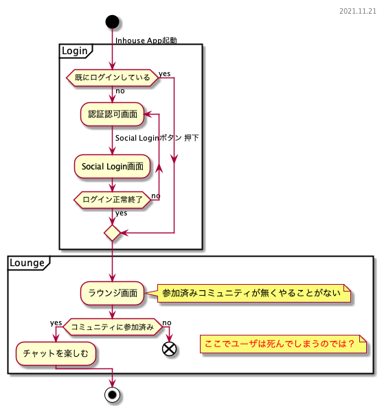
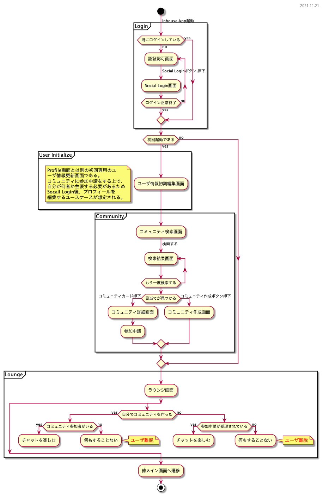

アプリをインストールしたてホヤホヤのユーザが、***ワクワクした状態のまま***メインディッシュを味わって欲しい。味に病み付きになった末に、友人や周囲にオススメしたくなるようなUIを持ってして、多くの人にinhouse Valueが届くと考える。ここでは*人にオススメしたくなるか*という観点は一旦放念し、使用開始直後のユーザがinhouse Valueを味合うまでの道筋を検討するために、この資料を作成した。

アプリ初期起動時はコミュニティに参加していないため、エンドユーザーはinhouse Valueを享受できない。アプリ初期起動から最低1つのコミュニティへの参加が完了するまでのUserActivityフローはユーザ体験の実現において最重要事項と捉え、「ユーザの離脱の阻止」を実現する。

- [1. アプリ初期起動からコミュニティ参加までのアクティビティフロー](#1-アプリ初期起動からコミュニティ参加までのアクティビティフロー)
  - [1.1. 現状](#11-現状)
  - [1.2 コミュニティ参加を行う場合](#12-コミュニティ参加を行う場合)
  - [memo](#memo)
  - [case](#case)
- [承認待ちの間何する?](#承認待ちの間何する)
- [習慣化](#習慣化)

## 1. アプリ初期起動からコミュニティ参加までのアクティビティフロー
### 1.1. 現状
ログイン後の遷移先をラウンジ画面をホームとしているが、コミュニティに参加していないためラウンジ画面ではやることがない。コミュニティ検索へ誘導することは機能的には可能だが、これはユーザアクションを強制するフローであるためUX上あってはならない。決して*大企業の社内マニュアル*であってはならないと考える。

### 1.2 コミュニティ参加を行う場合
ログイン後にコミュニティに参加(および作成)を行うフローを考える。
コミュニティを作成するケース数はコミュニティ数に依存しコミュニティに参加するケース数はユーザ数に依存することから、コミュニティに参加するケースが主だと考える。
コミュニティへの参加申請を行う場合、申請承認/却下が行われることをユーザが想像できない場合を考慮し、*自分が何者か*を主張するためにユーザー情報の編集を経る必要がある。

コミュニティへの参加申請をした場合、申請承認されるまでの間にできることがない。また、自身でコミュニティを作成した場合には参加者がいない場合にチャット機能を楽しむことができない。

### memo
- コミュニティの削除
  - 一定時間後に誰もNOと言われなければ消す
  - 最後の一人が抜けるときに一緒に消えると
- アルバムの編集/削除は誰でも出す
  - 中の写真の追加/削除を誰でも出す
- ログに出す
  - 参加申請の承認/却下
  - ユーザの退会
  - コミュニティ情報の編集
  - アルバムの削除
  - 中の写真の削除
  - イベントの編集/削除
- イベントの編集/削除
  - 誰でもできる

### case 
- 参加申請する側は、既に誰かがいるしコミュニティの存在を知っている前提だから多少待たせても、ワクワク落ちねえ。
- アプリ内招待 ->　これはユーザ離脱考え辛い
1. アプリ外招待 -> リンクを発行して外部アプリで送る -> 
2. 開いてインストールして 申請ボタンがある画面に飛ぶ 申請ボタンを押す 
3. 承認する

## 承認待ちの間何する?
- twitterのトレンドでも出しとけよ！

## 習慣化
-  

